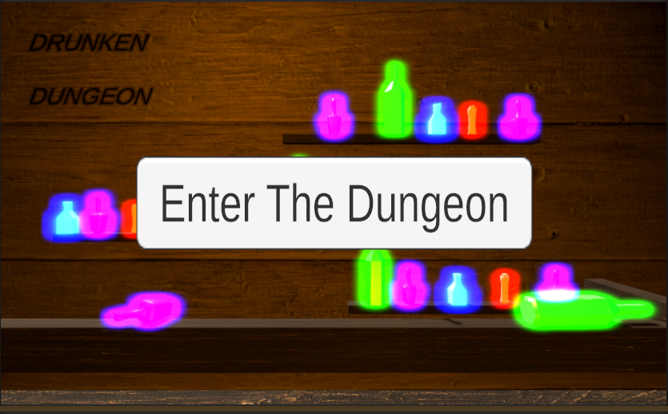
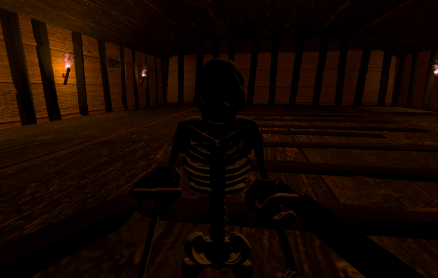
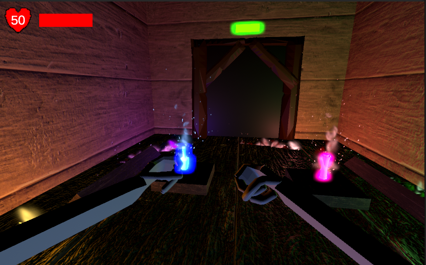

# Drunken Dungeon

Drunken Dungeon is an FPS Beat 'Em Up game where you drink to power yourself up. Navigate through a haunted dungeon and battle against spirits, skeletons, and other baddies as you drink your sorrows away. The more you drink, the stronger you become, but beware—the effects can also hinder your ability to fight!

## Project Overview

Drunken Dungeon was developed using **Unity Version 2022.3.1f** and leverages both 3D assets and dynamic game mechanics to create an engaging and challenging experience. The game is designed to provide a unique twist on the traditional FPS genre, combining combat mechanics with a strategic drinking system that affects gameplay.

### Primary Features
- **Unique Combat System**: Fight various enemies such as spirits, skeletons, and other dungeon creatures.
- **Drinking Mechanic**: Drink to enhance your abilities and stats temporarily, but be mindful of the consequences.
- **Variety of Enemies**: Encounter different types of enemies, each with unique abilities and strategies.
- **Immersive Dungeon Environment**: Explore a dark, atmospheric dungeon filled with secrets and challenges.

### Technologies Used
- **Unity 2022.3.1f**: Game engine used for development.
- **C#**: Primary programming language for game logic and mechanics.
- **Blender**: For 3D modeling and animation of game assets.
- **Adobe Photoshop/GIMP**: For creating textures and sprites.

## Screenshots

Below are some screenshots showcasing key aspects of Drunken Dungeon:

1. **Game Start Screen and Player HUD**:  
   

2. **Combat with Enemies**:  
   

3. **Dungeon Exploration**:  
   

## Technical Details

Drunken Dungeon is built on a modular architecture, allowing for easy expansion and maintenance of game components.

### Key Components
- **Player Controller**: Manages player movement, drinking mechanics, and interaction with the game environment.
- **Enemy AI**: Controls the behavior of various enemy types, including their attack patterns and movement.
- **Game Manager**: Oversees the game state, manages levels, and handles scoring and achievements.
- **Drinking System**: A unique mechanic that alters player stats and abilities based on the amount of alcohol consumed, introducing a strategic element to gameplay.

### Technical Challenges
One of the main challenges was implementing the drinking mechanic in a way that felt balanced and fun. We overcame this by creating a dynamic system that adjusts the player's abilities in real-time based on their intoxication level. This involved fine-tuning various parameters to ensure a fair challenge for players of different skill levels.

## Installation and Usage

To run Drunken Dungeon, follow these steps:

### Prerequisites
- **Unity 2022.3.35f1** (or later version) installed on your machine.
- A system capable of running Unity-developed games.

### Installation Steps
1. **Clone the Repository**:
   ```bash
   git clone https://github.com/yourusername/DrunkenDungeon.git
   ```
2. **Open the Project in Unity**:
   - Launch Unity Hub.
   - Click on "Open" and navigate to the cloned repository folder.
   - Select the project folder to load it into Unity.

3. **Run the Game**:
   - Once the project is loaded in Unity, press the "Play" button to start the game in the editor.
   - Alternatively, build the game for your preferred platform via **File > Build Settings...** and follow the instructions to create an executable.

### Usage
- **Controls**: Use standard FPS controls (WASD for movement, mouse for camera).
- **Drinking**: Press the assigned key to drink and temporarily boost your stats.
- **Combat**: Engage enemies using a variety of weapons and abilities.

## Contributing

If you'd like to contribute to Drunken Dungeon, please fork the repository and use a feature branch. Pull requests are warmly welcome.

## License

This project is licensed under the MIT License. See the `LICENSE` file for details.
